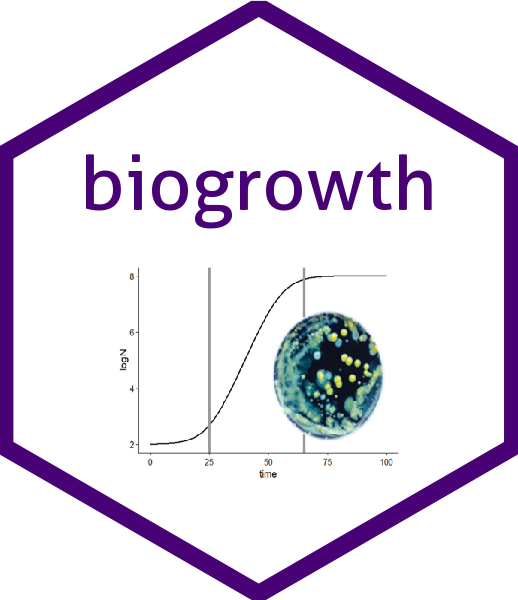

<!-- README.md is generated from README.Rmd. Please edit that file -->

```{r, include = FALSE}
knitr::opts_chunk$set(
  collapse = TRUE,
  comment = "#>",
  fig.path = "man/figures/README-",
  out.width = "100%"
)
```
# biogrowth web 

```{r, echo=FALSE}
library(badger)
```


<!-- badges: start -->
`r badge_lifecycle("maturing", "blue")`
<!-- badges: end -->

The goal of biogrowth web is to serve as a friendly user interface to the function included in the biogrowth R package for R. This includes:

* making predictions under static environmental conditions.
* making predictions under dynamic environmental conditions.
* making predictions under static or dynamic conditions considering parameter uncertainty.
* fitting models to data gathered under static environmental conditions.
* fitting models to data gathered under dynamic environmental conditions.

Moreover, it provides statistical information of all the fit and several publication-ready plots of the results.

## Authors

The biogrowth package has been developed by researchers of the Food Microbiology Laboratory of Wageningen University and Research.

* Alberto Garre,
* Jeroen Koomen,
* Heidy den Besten,
* Marcel Zwietering.

Questions and comments can be directed to Alberto Garre (alberto.garreperez (at) wur.nl). For bug reports, please use the GitHub page of the project.


## Installation

The web application can be accessed from [this link](https://foodmicrowur.shinyapps.io/biogrowth). It only requires an internet connection and a web browser; no installation of R is needed. 

The application can also be built to run offline. In that case, please contact the software developpers.


