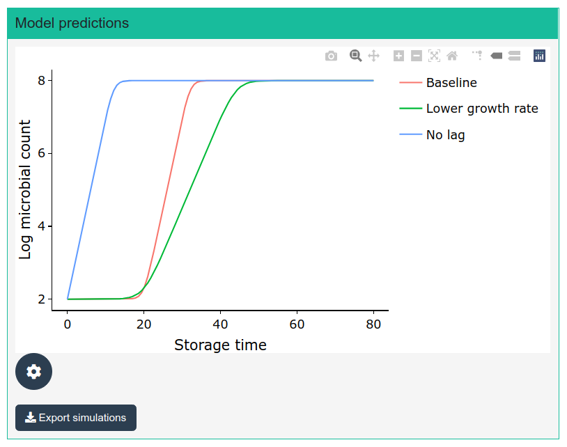

```{r setup, include=FALSE}
knitr::opts_chunk$set(echo = TRUE)
```

## Growth prediction under static conditions

## Model definition

The first step when using this module is the definition of the growth model. The user can choose among any of the growth models available in **biogrowth** for static conditions using a picker input. Then, the values of the model parameters are defined using the numeric inputs below. These numeric inputs are adapted to the model selected, showing only the parameters that are relevant for the chosen model.

Once the model parameters have been defined, the calculation is done using the "Add/Edit simulation". The simulated storage time is specified using the "Maximum time" numeric input. The simulation is assigned a name using the "Simulation name" text input. If the model had already been defined within the session, the model prediction is updated. If not, a new model prediction is calculated.

### Interpretation of the model parameters

* `log N0`: Decimal logarithm of the initial population size (in log CFU/g).
* `log Nmax`: Maximum population size in the stationary growth phase (in log CFU/g).
* `C`: Difference between the logarithm of the initial population size and the logarithm of the population size during the stationary phase (in log CFU/g).
* `mu`: Maximum growth rate during the exponential growth phase. Note that this parameter must be defined in log10 scale, being the slope of the curve during the exponential phase in the $\log N$ vs $t$ plot. This parameter can be calculated from the specific growth rate dividing the latter by $\ln 10$.
* `lambda`: Duration of the lag phase (in hours). This parameter is defined as the intersection between a horizontal line with intercept $\log N_0$ and a straight line tangential to the growth curve at the point of maximum growth rate.
* `nu`: Shape factor of the Richards model. Lower values of this parameter result in a sharper transition between each growth phase.

## Visualization of the model predictions

Clicking the "Add/Edit Simulation" button updates the plot in the "Model predictions" box. It shows on growth curve for each one of the models defined. The plot is highly interactive, allowing operations like zooming or panning. Hoovering over the lines shows the numeric values of the model predictions. The plot can be downloaded as .png file using the toolbar on top of the plot.

{width=50%}

The plot can be cleared using the "Clear plot" button. The results of the simulations can be downloaded as a .csv file using the "Export simulations" button.

## Estimation of the time required to reach a given population size

This module provides an estimation of the storage time required to reach a given population size in the box named "Time to X log count". The user must first input the decimal logarithm of the target population size. Then, the tool outputs the results as a table, where each row shows the time to reach the target population size for one model.

This time is estimated by linear interpolation of the model predictions using the `approx` function of R thus introducing a small truncation error. Nonetheless, this error is very small, especially when compared to other uncertainty sources. 

## Estimation of the population size at a given time

The tool also allows to calculate the population size at a specific time point for each model defined. Note that, as well as for the time to reach a given population size, this is estimated based on linear interpolation. Therefore, a small truncation error is introduced.


